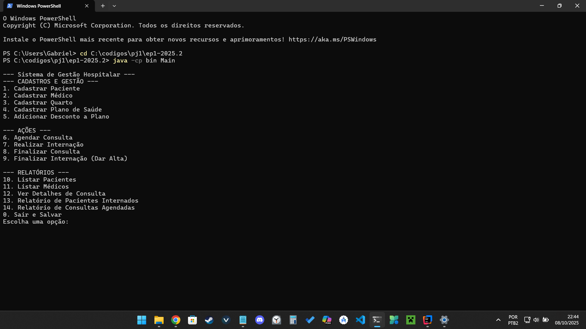
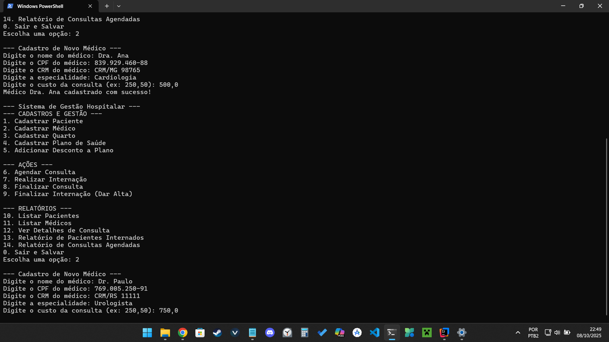
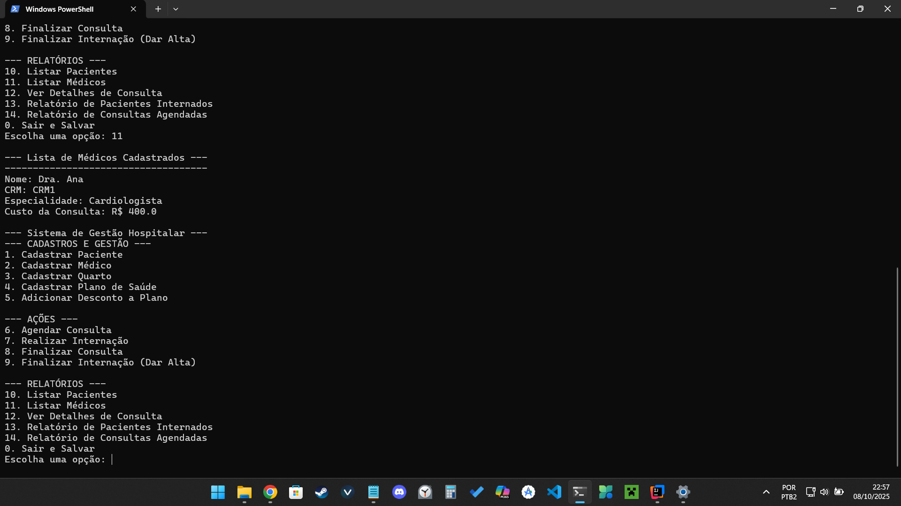
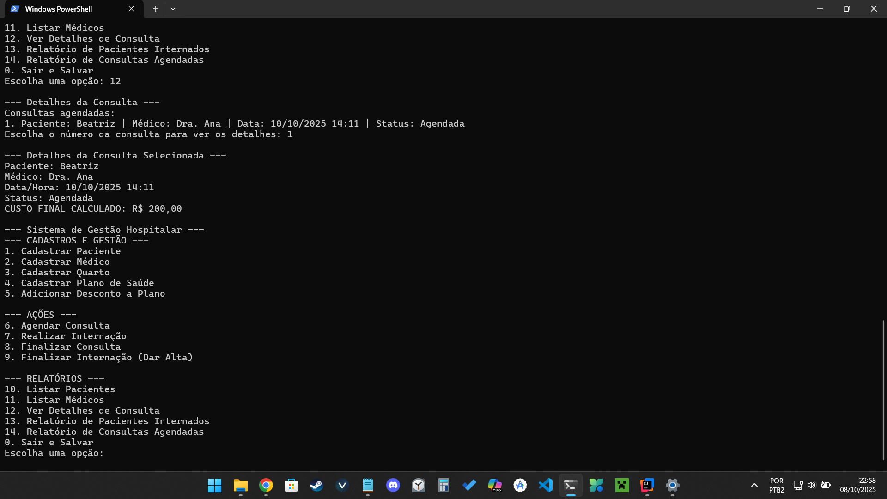
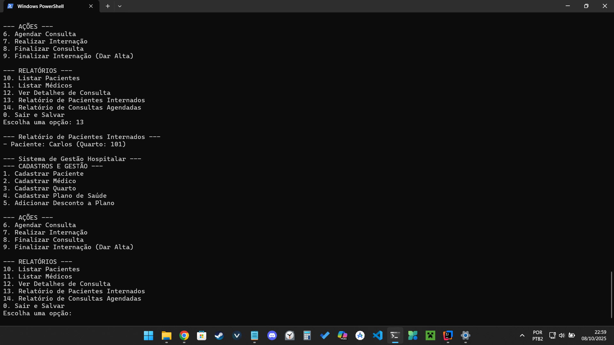
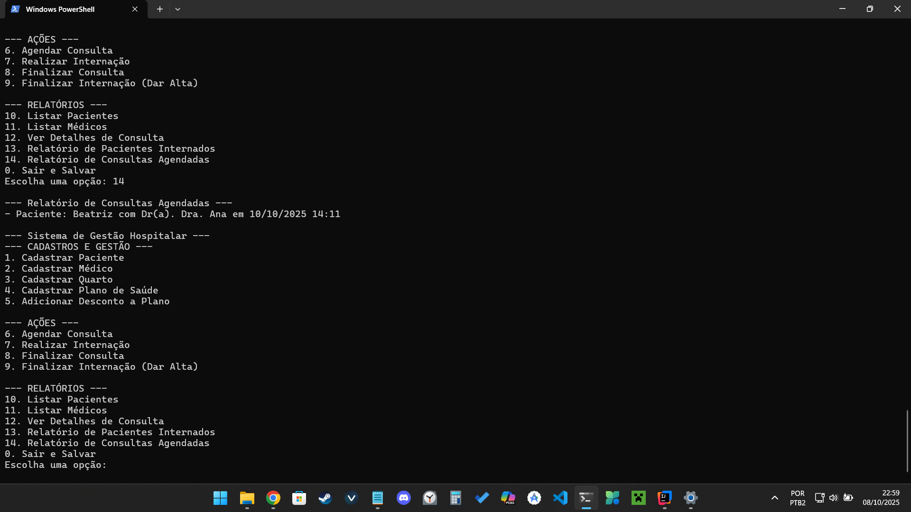

# 🏥 Trabalho Prático – Sistema de Gerenciamento Hospitalar  

### 🎯 Objetivo  
Implementar um *Sistema de Gerenciamento Hospitalar* em *Java, aplicando conceitos avançados de **Programação Orientada a Objetos (POO), com foco em **herança, polimorfismo, encapsulamento, persistência de dados* e *regras de negócio mais complexas*.  

---
## Descrição do Projeto

Desenvolvimento de um sistema de gerenciamento hospitalar utilizando os conceitos de orientação a objetos (herança, polimorfismo e encapsulamento) e persistência de dados em arquivos.

## Dados do Aluno

- **Nome completo:** Gabriel José Neves de Resende
- **Matrícula:** 251040087
- **Curso:** Engenharias Unb gama fcte
- **Turma:** 02 -> 25.2

---

## Instruções para Compilação e Execução

1. **Compilação:**  
   A compilação é gerida automaticamente pela IDE. Não é necessário executar nenhum comando manual. Sempre que o projeto é executado (passo seguinte), a IDE garante que todos os ficheiros .java são compilados para ficheiros .class na pasta out/

2. **Execução:**  

    1) Abra o projeto na sua IDE Java.

    2) Navegue até o ficheiro src/Main.java.

    3) Clique com o botão direito no ficheiro Main.java e selecione a opção "Run 'Main.main()'" ou clique no ícone de "play" que aparece ao lado do método main.

    4) O programa será iniciado e o menu interativo aparecerá no terminal da IDE.

3. **Estrutura de Pastas:**  
   O projeto está organizado da seguinte forma:
src/: Contém todo o código-fonte do projeto (os ficheiros .java).
out/: Pasta gerada pela IDE que contém os ficheiros compilados (.class).
Raiz do Projeto (/): Onde os ficheiros de dados (pacientes.csv, medicos.csv, etc.) são criados e lidos.

3. **Versão do JAVA utilizada:**  
   O projeto foi desenvolvido e testado com Java 17 mas funciona com versões mais recentes.

---

## Vídeo de Demonstração

- https://drive.google.com/drive/folders/1AjfD0DRKM7OrFwKvDwXvaOmiaNYqB6T1?usp=sharing

---

## Prints da Execução

1. Menu Principal:  
   

2. Cadastro de Médico:  
   (caminho/do/print2.png)

3. Relatórios:     
   Listar Pacientes;Listar Médicos;Ver Detalhes de Consulta;Relatório de Pacientes Internados;Relatório de Consultas Agendadas

---

---

## Observações (Extras ou Dificuldades)

Durante o desenvolvimento, o maior desafio técnico foi, sem dúvida, a implementação da persistência de dados (a capacidade de salvar e carregar as informações).

O Principal Desafio
O problema principal era: como salvar em ficheiros de texto simples (.csv) as relações complexas entre os objetos? Por exemplo, uma Consulta não é apenas texto; ela está ligada a um objeto Paciente e a um objeto Medico. Salvar apenas os nomes não seria suficiente.

A Solução Implementada
A solução foi criar uma classe dedicada, GerenciadorDeArquivos, com uma estratégia clara:

Salvar Usando Identificadores: Ao salvar uma consulta ou internação, em vez de tentar salvar o objeto inteiro, o sistema guarda apenas os identificadores únicos (CPF do paciente, CRM do médico, número do quarto). Isto manteve os ficheiros de dados simples e organizados.

Carregar em Ordem Lógica: Ao iniciar o programa, o sistema primeiro carrega todas as "peças" (Pacientes, Médicos, Quartos). Só depois é que ele carrega os "eventos" (Consultas, Internações). Para cada evento, ele usa os identificadores (CPF, CRM) para "reconectar" e reconstruir o objeto Consulta ou Internacao com as ligações corretas aos objetos já existentes na memória.

Esta abordagem garantiu que todas as relações fossem preservadas entre as sessões do programa, tornando a "memória" do sistema fiável e robusta.

---

## Contato

- gabriel.jn.resende@gmail.com

---

### 🖥️ Descrição do Sistema  

O sistema deve simular o funcionamento de um hospital com cadastro de *pacientes, médicos, especialidades, consultas e internações*.  

1. *Cadastro de Pacientes*  
   - Pacientes comuns e pacientes especiais (ex: com plano de saúde).  
   - Cada paciente deve ter: nome, CPF, idade, histórico de consultas e internações.  

2. *Cadastro de Médicos*  
   - Médicos podem ter especialidades (ex: cardiologia, pediatria, ortopedia).  
   - Cada médico deve ter: nome, CRM, especialidade, custo da consulta e agenda de horários.  

3. *Agendamento de Consultas*  
   - Um paciente pode agendar uma consulta com um médico disponível.  
   - Consultas devem registrar: paciente, médico, data/hora, local, status (agendada, concluída, cancelada).  
   - Pacientes especiais (plano de saúde) podem ter *vantagens*, como desconto.  
   - Duas consultas não podem estar agendadas com o mesmo médico na mesma hora, ou no mesmo local e hora

4. *Consultas e Diagnósticos*  
   - Ao concluir uma consulta, o médico pode registrar *diagnóstico* e/ou *prescrição de medicamentos*.  
   - Cada consulta deve ser registrada no *histórico do paciente*.  

5. *Internações*  
   - Pacientes podem ser internados.  
   - Registrar: paciente, médico responsável, data de entrada, data de saída (se já liberado), quarto e custo da internação.  
   - Deve existir controle de *ocupação dos quartos* (não permitir duas internações no mesmo quarto simultaneamente).  
   - Internações devem poder ser canceladas, quando isso ocorrer, o sistema deve ser atualizado automaticamente.

6. *Planos de saúde*    
   -  Planos de saude podem ser cadastrados.
   -  Cada plano pode oferecer *descontos* para *especializações* diferentes, com possibilidade de descontos variados.
   -  Um paciente que tenha o plano de saúde deve ter o desconto aplicado.
   -  Deve existir a possibilidade de um plano *especial* que torna internação de menos de uma semana de duração gratuita.
   -  Pacientes com 60+ anos de idade devem ter descontos diferentes.

7. *Relatórios*  
   - Pacientes cadastrados (com histórico de consultas e internações).  
   - Médicos cadastrados (com agenda e número de consultas realizadas).  
   - Consultas futuras e passadas (com filtros por paciente, médico ou especialidade).  
   - Pacientes internados no momento (com tempo de internação).  
   - Estatísticas gerais (ex: médico que mais atendeu, especialidade mais procurada).  
   - Quantidade de pessoas em um determinado plano de saúde e quanto aquele plano *economizou* das pessoas que o usam.  

---

### ⚙️ Requisitos Técnicos  
- O sistema deve ser implementado em *Java*.  
- Interface via *terminal (linha de comando)*.  
- Os dados devem ser persistidos em *arquivos* (.txt ou .csv).  
- Deve existir *menu interativo*, permitindo navegar entre as opções principais.  

---

### 📊 Critérios de Avaliação  

1. *Modos da Aplicação (1,5)* → Cadastro de pacientes, médicos, planos de saúde, consultas e internações.  
2. *Armazenamento em arquivo (1,0)* → Dados persistidos corretamente, leitura e escrita funcional.  
3. *Herança (1,0)* → Ex.: Paciente e PacienteEspecial, Consulta e ConsultaEspecial, Médico e subclasses por especialidade.  
4. *Polimorfismo (1,0)* → Ex.: regras diferentes para agendamento, preços de consultas.
5. *Encapsulamento (1,0)* → Atributos privados, getters e setters adequados.  
6. *Modelagem (1,0)* → Estrutura de classes clara, bem planejada e com relacionamentos consistentes.  
7. *Execução (0,5)* → Sistema compila, roda sem erros e possui menus funcionais.  
8. *Qualidade do Código (1,0)* → Código limpo, organizado, nomes adequados e boas práticas.  
9. *Repositório (1,0)* → Uso adequado de versionamento, commits frequentes com mensagens claras.  
10. *README (1,0)* → Vídeo curto (máx. 5 min) demonstrando as funcionalidades + prints de execução + explicação da modelagem.  

🔹 *Total = 10 pontos*  
🔹 *Pontuação extra (até 1,5)* → Melhorias relevantes, como:  
- Sistema de triagem automática com fila de prioridade.  
- Estatísticas avançadas (tempo médio de internação, taxa de ocupação por especialidade).  
- Exportação de relatórios em formato .csv ou .pdf.  
- Implementação de testes unitários para classes principais.  
- Menu visual.
